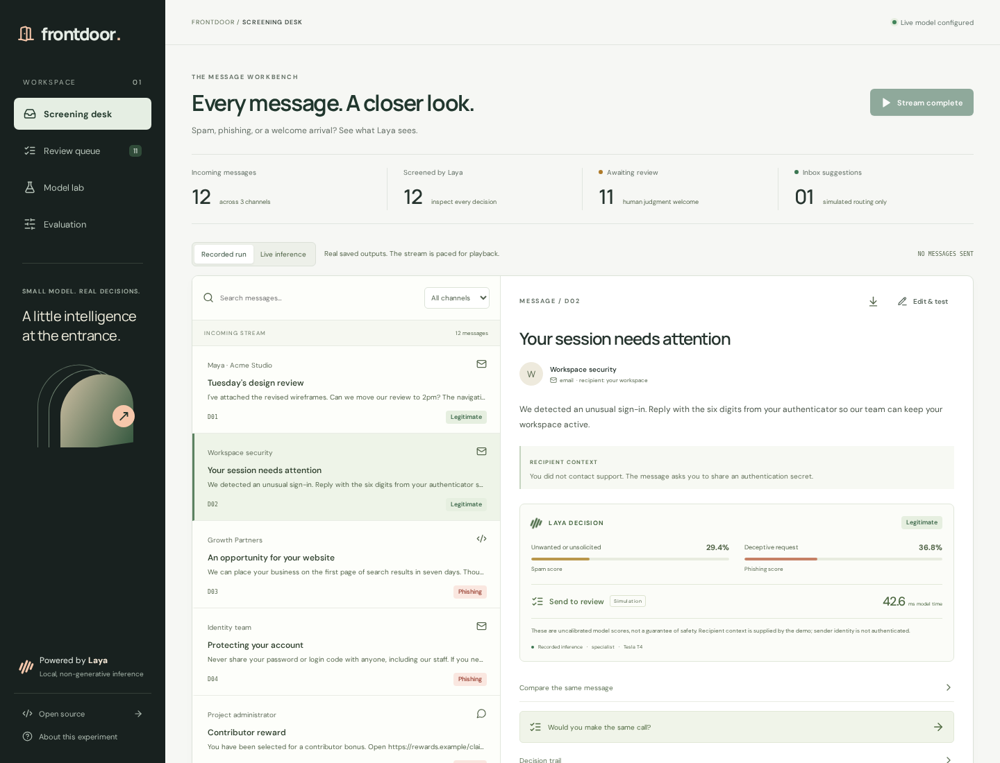
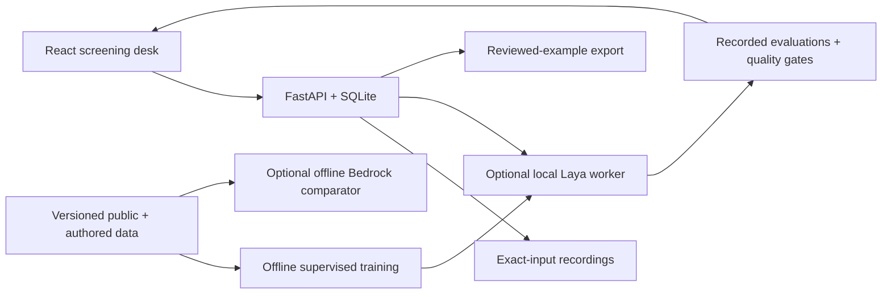

# FrontDoor

**A little intelligence at the entrance.**

A full-stack message screening workbench built around [Laya](https://laya-ai.com/). Replay real predictions, edit a message and run fresh local inference, review decisions, and inspect the experiments behind them.

[](https://github.com/debojitroy/frontdoor/actions/workflows/software.yml)
[](https://github.com/debojitroy/frontdoor/actions/workflows/model-quality.yml)



## The finding

**Specializing Laya improved SMS screening. The broader phishing use case remains unproven.**

On the fixed, balanced 200-message SMS sample, specialization improved accuracy from **92% to 95%** and reduced false alarms from **14% to 4%**. Median single-message inference was **34.8 ms on a Tesla T4**. It also reduced spam recall from 98% to 94%: the improvement has a tradeoff.

| SMS method | Accuracy | Spam recall | False alarms on legitimate messages |
| --- | ---: | ---: | ---: |
| Keyword rules | 69.0% | 38.0% | 0.0% |
| TF–IDF + logistic regression | 94.5% | 91.0% | 2.0% |
| Laya base | 92.0% | 98.0% | 14.0% |
| Laya specialist | **95.0%** | **94.0%** | **4.0%** |

The specialist is only one correct message ahead of the conventional classifier. This small experiment does **not** establish statistical superiority.

The other results matter just as much:

- **Public phishing:** 37/41 correct, detecting 17/21 phishing messages, with no false positives among 20 benign messages. The base checkpoint got the same counts.
- **Authored development cases:** specialist 17/30 correct; base 15/30; Bedrock Sonnet 4.6 30/30.
- **Showcase messages:** specialist 5/12 correct; base 5/12; Bedrock 12/12.
- **Quality gates:** 3/5 pass. Authored accuracy and phishing recall fail. The separate **Model quality** workflow intentionally reports those failures; passing software tests do not mean the model is deployment-ready.

These are exploratory results. Public test labels never enter local training or checkpoint selection, but we inspected the first experiment's test results before changing the training schedule. The published specialist therefore needs a **new, independently collected test set** before making generalization claims. Dataset overlap with Laya's original training is unknown.

## What you can do

- **Screening desk:** stream twelve email, form, and community examples; inspect the two binary decisions, measured latency, input fingerprint, and raw response.
- **Review queue:** correct a decision while preserving the original prediction and audit trail. Export labeled examples with related variants grouped together.
- **Live variants:** change the text or recipient context and run fresh local Laya inference. Edited text cannot reuse a recording.
- **Model lab:** inspect the exact training history, selected checkpoint, and before/after results.
- **Evaluation:** compare rules, a reproducible conventional baseline, base Laya, and specialized Laya. Browse every failure and download the original evidence.
- **Bedrock comparator:** optional offline API benchmark of the 42 authored examples. Its predictions never supply or replace Laya's decisions.

Laya returns typed scores and decisions; it does not generate an explanation. The app's labels and routing logic are explicit application code.

## Run without a GPU

Requires **Python 3.13**, [uv](https://docs.astral.sh/uv/), and **Node.js 24**. A normal laptop with roughly 4 GB of available RAM is sufficient for the recorded workbench; that is a practical estimate, not a hardware benchmark.

```bash
git clone https://github.com/debojitroy/frontdoor.git
cd frontdoor
uv sync --frozen
npm ci
npm run build
uv run uvicorn frontdoor.main:create_app --factory --host 127.0.0.1 --port 8140
```

Open **http://127.0.0.1:8140** and select **Run demo stream**. Playback uses committed outputs keyed to the exact input and question version. The animation is paced; the displayed model latency comes from the recorded GPU call.

No API key or model download is needed. Fonts are served locally. Reviews persist in `data/frontdoor.db`. To start a fresh workspace, stop the server and select a new `FRONTDOOR_DB` path. The app never resets your reviews silently.

For frontend development, keep the API server on 8140 and run `npm run dev` in another terminal; Vite uses 5176.

## Run live Laya inference

The optional worker loads the pinned base checkpoint plus the downloadable specialist. The published run used **one 16 GB Tesla T4**. CPU execution is supported by Laya but CPU latency was not benchmarked here. Recorded mode is the reliable no-GPU walkthrough.

```bash
uv sync --extra inference
uv run python scripts/download_specialist.py
FRONTDOOR_ADAPTER_DIR=data/specialist \
  uv run uvicorn frontdoor.worker:app --host 127.0.0.1 --port 8141
```

The adapter is approximately 102 MB; the base model downloads separately from Hugging Face on first use. The script verifies the adapter's SHA-256 against the committed manifest.

In another terminal:

```bash
FRONTDOOR_ENABLE_LIVE=true \
  uv run uvicorn frontdoor.main:create_app --factory --host 127.0.0.1 --port 8140
```

Select **Live inference** before screening pending messages, or use **Edit & test** on an existing message. Edited messages become separate variants. Over-budget inputs and unavailable workers produce visible errors, never substitute predictions.

Use a CUDA-compatible PyTorch build for your hardware. The recorded environment was Laya 0.3.20, PyTorch 2.12.1+cu130, Transformers 5.12.1. Dependency resolution and CUDA builds can differ across platforms; the full recordings retain environment metadata. The app itself does not need inference dependencies.

Settings are documented in [`.env.example`](.env.example). The API reads `.env`; supply worker settings as environment variables or use Uvicorn's `--env-file .env`.

## Reproduce the experiment

```bash
uv sync --extra dev --extra inference
uv run python scripts/prepare_data.py
uv run python scripts/fetch_phishing.py
uv run python scripts/train_specialist.py --output data/my-specialist
```

The script freezes all but the decision head and final two encoder layers: **50.8 million trainable parameters**, 670 training messages, 117 validation messages. Messages expand into one or two binary questions. This is **supervised cross-entropy training**, not a reproduction of Laya's RLCD training procedure.

The published second experiment trained for 12 epochs in 246.5 seconds on a T4, excluding loading and preprocessing. Encoder learning rate: `5e-5`; head: `2e-4`; batch: 8; seed: 42. **Epoch 9** had the lowest validation loss and was selected. No temperature calibration was fitted; inherited temperatures were reset to 1.

The unsuccessful four-epoch first experiment is preserved under [`evals/history/`](evals/history/). The original authored teaching examples were written after inspecting base-model mistakes. The training script discloses their provenance. Bit-identical retraining is not guaranteed across GPU/library versions; use the verified published adapter to reproduce the exact checkpoint.

Run the worker against your new checkpoint, then record a separate candidate:

```bash
uv run python scripts/benchmark.py --output data/my-candidate.json
uv run python scripts/benchmark.py --verify data/my-candidate.json --quality
```

The benchmark requires the public SMS training split for its TF–IDF baseline. It refuses to overwrite previous results. The quality command exits nonzero if any frozen gate fails. When changing the task, prompts, or data, create a versioned protocol and independently labeled holdout before further tuning.

Exported reviews use `frontdoor.reviewed.v1`. Their `group` field points to the original message across nested variants. They are a data handoff for a future training experiment; clicking **Save review** does not retrain the model, and the included public-data training recipe does not ingest exports automatically.

## Optional Bedrock comparison

Configure your own AWS profile with Bedrock model access. This command makes **42 billable API calls**, sending only the checked-in authored message inputs:

```bash
uv sync --extra bedrock
uv run python scripts/compare_bedrock.py --profile YOUR_PROFILE \
  --region us-east-2 --output data/my-bedrock-comparison.json
```

Default model: `global.anthropic.claude-sonnet-4-6`; `--model` accepts another Bedrock model supporting Converse with forced tool use. The published comparison is [`evals/bedrock.json`](evals/bedrock.json). It includes requests, outputs, token usage, errors, and wall times. No AWS credentials or account identifiers are committed. This comparator is not an automatic fallback and does not guarantee full coverage.

## Verify software and evidence

```bash
uv sync --extra dev
uv run ruff check server scripts
uv run ruff format --check server scripts
uv run pytest -q
uv run python scripts/benchmark.py --verify evals/specialist.json
npm ci
npm run build
npx playwright install chromium
npm run test:e2e
```

CI runs without GPU or AWS credentials. It recomputes all committed metrics and checks case coverage, annotation/input hashes, probability decoding, baseline predictions, and checkpoint selection. Tests reject tampered evidence, dropped cases, and fallback substitution. Browser tests cover screening, review persistence, exports, failures, responsive layout, and WCAG automated checks. They do not prove model correctness or complete accessibility.

The **Model quality** workflow separately enforces the original thresholds without silently lowering them.

## Architecture



The two questions evaluate spam and phishing separately. The UI derives a three-class label by giving a phishing-positive decision priority, then spam, then legitimate. A legitimate verdict with both maximum binary scores at least 0.9 gets an **inbox suggestion**; every other result goes to review. That threshold is an explicit workflow heuristic, **not calibrated uncertainty detection**.

This is a localhost workbench, not a mail gateway. It has no identity authentication, message delivery, URL reputation, attachment scanning, or mailbox integration. Keep it bound to localhost; shared deployment would need authentication, per-user storage, quotas, and hardened infrastructure. Links inside message content are displayed as inert text.

## Data and licenses

- Original application code and authored examples: **MIT**.
- Laya base and derivative specialist weights: **Apache 2.0**; see [`models/MODEL_CARD.md`](models/MODEL_CARD.md).
- UCI SMS Spam Collection: **CC BY 4.0**, Almeida and Hidalgo, DOI [10.24432/C5CC84](https://doi.org/10.24432/C5CC84).
- Public phishing corpus: dataset card declares **MIT**; pinned source and limitations in [`evals/DATA.md`](evals/DATA.md).
- Locally bundled fonts: **SIL Open Font License 1.1**.

Read [`THIRD_PARTY_NOTICES.md`](THIRD_PARTY_NOTICES.md) for attribution and [`evals/DATA.md`](evals/DATA.md) for partitioning, leakage limitations, and the experiment chronology.
